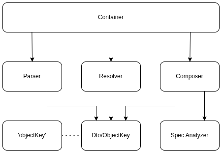

# Main components in DI



## The Container

The Container is the main component of the DI library. It is the object that allows to get other objects in runtime:

```javascript
const anObject = await container.get('objectKey');
```

## The Object Key

The `objectKey` is a concise, one-string instruction for the Container on how to **obtain** sources **and create** the
required runtime object. The format of this string depends on the requirements for object creation in a project. Here is
a simple example of an `objectKey`:

```javascript
const key = '@vendor/package/src/Es6Mod.exportName';
```

Here is a more complex example (URL-like):

```javascript
const key = '@vendor/package/src/Es6Mod#exportName?isFactory&isSingleton&wrapper=Proxy';
```

I want to draw your attention to the fact that the `objectKey` is a value used in the runtime mode of an app. It not
only describes where to obtain sources for a dependency but also how to create that dependency.

## The Object Key DTO

This DTO contains the structured definition of the `objectKey` instruction. In general, it can consist of the following
parts:

* Name of an ES6 module: it can be converted into the path of this module in the Resolver.
* Export: named, default, or the ES6 module itself.
* Lifestyle: singleton or transient.
* Factory flag: indicates whether we should use the export as a factory function to create a new object.
* Adapters: a list of wrappers to wrap the created object.

Every developer can imagine their own structure for the `objectKey` and this DTO. The structure mentioned here reflects
the tasks I have encountered in my apps.

## The Parser

The Parser is a function that converts the `objectKey` into the DTO according to the format used in the current project.

We can have one DTO structure and different formats of the `objectKey`, such as:

* `@vendor/package/src/Es6Mod#exportName`
* `@vendor.package.Es6Mod#exportName`
* `Vendor_Package_Es6Mod.exportName`

## The Spec Analyzer

This object analyzes the dependencies of any factory function or constructor:

```javascript
function Factory(
    {
        logger,
        config,
        ['@vendor.package.Es6Mod#exportName']: dep
    }
) {}
```

The result of the analysis is:

```javascript
const res = ['logger', 'config', '@vendor.package.Es6Mod#exportName'];
```

## The Resolver

This object converts the name of the ES6 module to the path of the sources based on the current environment (browser or
Node.js) and loads the sources. The Resolver and the Parser are interconnected through the structure of the Object Key
DTO.

## The Composer

This object uses loaded ES6 modules and generates objects based on the provided `objectKey`. The Composer and the Parser
are interconnected through the structure of the Object Key DTO.
